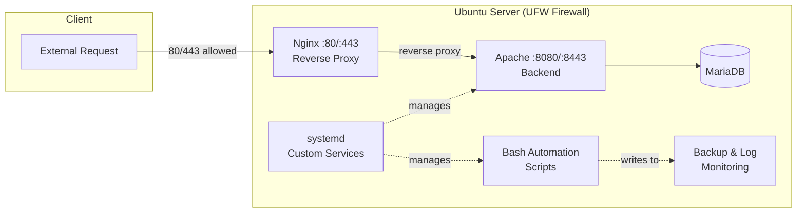

# Ubuntu Server Sysadmin Roadmap
 

 
A hands-on, 12-step Linux server administration project — built from a bare Ubuntu Server install up through networking, security, web serving, monitoring, backups, databases, automation, and custom systemd services. Each step is documented with the reasoning behind the setup, not just the commands run.
 
This repo is a working portfolio piece on the path toward Cloud Engineering, built through System Administration and networking fundamentals.
 
---
 
## Architecture
 

 
> UFW allows only 80/443 externally. Nginx terminates and reverse-proxies to Apache on 8080/8443, which stay closed to outside traffic — see [Step 4](./04-firewall-rules.md) for the localhost-bypass investigation behind this design.
 
---
 
## Key Highlights
 
Beyond following steps, these are the parts that involved actual troubleshooting and design decisions:
 
- **Diagnosed a UFW false positive** — an internal `nmap` scan showed ports 8080/8443 as "open" even though UFW rules didn't allow them. Traced this to localhost-to-self traffic bypassing UFW's interface-level filtering, and documented the distinction between that and real external exposure. ([Step 4](./04-firewall-rules.md))
- **Reverse proxy architecture** — Nginx (80/443) in front of Apache (8080/8443), rather than exposing the app server directly. ([Step 5](./05-web-server.md))
- **Custom systemd service creation** — wrote and debugged a custom `.service` unit from scratch, including dependency ordering and restart policy. ([Step 12](./12-systemd.md))
- **Automation via Bash** — scripted repetitive admin tasks instead of doing them manually. ([Step 11](./11-bash-scripting.md))
---
 
## Roadmap
 
| # | Step | Summary | Docs |
|---|------|---------|------|
| 1 | Install Ubuntu Server | Clean install from ISO, initial config from scratch | [01-install-ubuntu-server](./01-install-ubuntu-server.md) |
| 2 | Static IP & Networking | Configured static IP and core network settings | [02-static-ip-networking](./02-static-ip-networking.md) |
| 3 | SSH Keys | Set up and managed key-based SSH authentication | [03-ssh-keys](./03-ssh-keys.md) |
| 4 | Firewall Rules | UFW config; investigated and resolved a false-positive port scan | [04-firewall-rules](./04-firewall-rules.md) |
| 5 | Web Server | Nginx reverse-proxying to Apache | [05-web-server](./05-web-server.md) |
| 6 | Users & Permissions | Managed users, groups, and permission structures securely | [06-users-permissions](./06-users-permissions.md) |
| 7 | System Monitoring | Tracked CPU, memory, and system resource usage | [07-system-monitoring](./07-system-monitoring.md) |
| 8 | Logs | Read and interpreted system logs for troubleshooting | [08-logs](./08-logs.md) |
| 9 | Backup & Restore | Set up file backup and restore procedures | [09-backup-restore](./09-backup-restore.md) |
| 10 | Database | Installed and configured MariaDB | [10-database](./10-database.md) |
| 11 | Bash Scripting | Wrote scripts to automate admin tasks | [11-bash-scripting](./11-bash-scripting.md) |
| 12 | Systemd & Services | Created and debugged a custom systemd service | [12-systemd](./12-systemd.md) |
 
---
 
## Environment
 
- **OS:** Ubuntu Server <!-- isi versi, mis. 22.04 LTS -->
- **Virtualization/Host:** <!-- mis. VirtualBox / Proxmox / cloud provider -->
- **Specs:** <!-- vCPU / RAM / disk -->
---
 
## Why this project
 
Certifications show you know the theory. This repo shows the work: setting up a server, breaking things, figuring out why, and fixing them properly — the kind of hands-on troubleshooting that maps directly to real System Administration and Cloud Engineering work.
